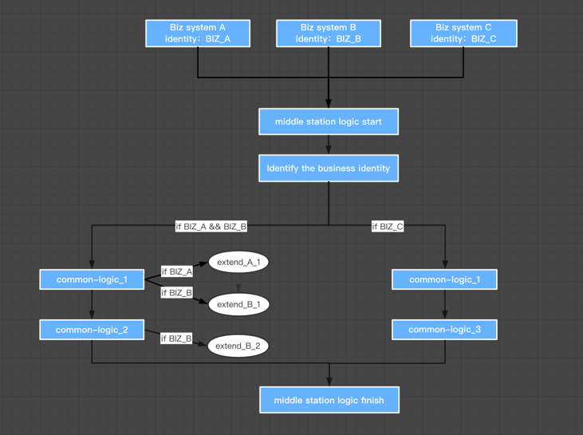

#middle-logic-engine

  

---
## middle station logic engine
Most of the traffic of the middle station system comes from multiple systems, many of different logic dispose on same business. 
middle-logic-engine support the front-system define a business identity, and use process engine handle all the different logic. 
also support extend-point on satisfy certain conditions. 
Follow the DDD driver model

## architecture
#### Basic Architecture
 - coming soon

#### Concepts

DDD driver model has three layer of hold system:
- business system scope: front business system
- business middle system scope: assembly capability domain provides the business process
- ability scope: specific business capabilities

middle-logic-engine working on `business middle system scope`, define business process, add extend point, business scenario and life cycle.

## guide

