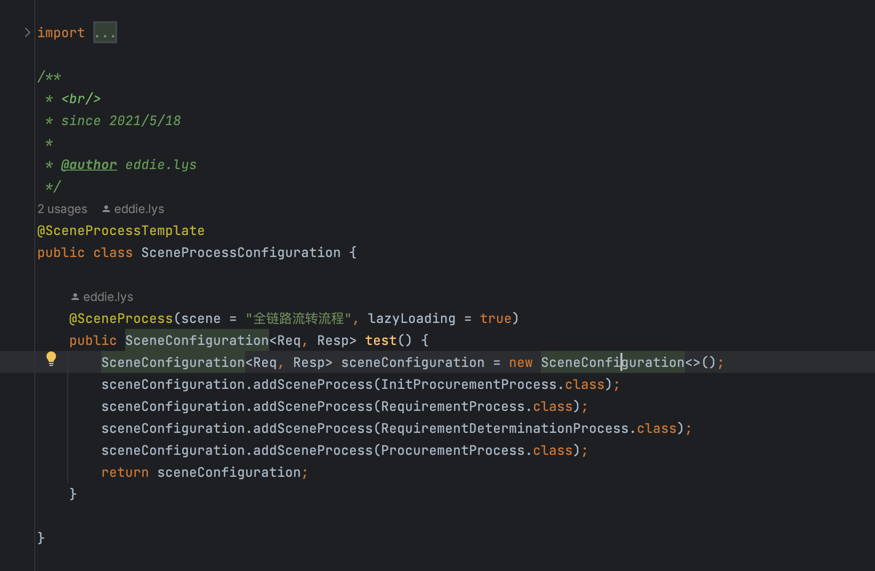

# olympus-athena
<div>
  
</div>

---
## middle station logic engine
Most of the traffic of the middle station system comes from multiple systems, many of different logic dispose on same business.</br>
middle-logic-engine support the front-system define a business identity, and use process engine handle all the different logic.</br>
also support extend-point on satisfy certain conditions.</br>
Follow the DDD driver model

## architecture
#### Basic Architecture


#### Concepts
DDD driver model has three layer of hold system:
- business system scope: front business system
- business middle system scope: assembly capability domain provides the business process
- ability scope: specific business capabilities

middle-logic-engine working on `business middle system scope`, define business process, add extend point, business scenario and life cycle.

## guide
- Step 1:
  
  engine needs at last one `SceneProcessConfiguration`, to description the class is engine scene configuration, and `@SceneProcess` for define a process.
- Step 2:
  
  on spring main class, `@EnableExtendPointAutoConfiguration({SceneProcessConfiguration.class})` to activate engine，require one or more `SceneProcessConfiguration` to load process
- Step 3:
  
  in process define, implements `StandardProcess<Req, Resp>`, Req means parameter, and Resp means a empty that will fill in the process, so `Req` and `Resp` both must create before process start
- Step 4:
  
  instantiation a scheme to identify which business scene, like `全脸路流转流程`, in this case, also have `biz` argument, `biz` for extension runner to match which `ext` execute is current process.
  `ext` needs Template, 
  ```java
  @Template
  public class OrderTemplate implements ExtensionTemplate {
  
      @Override
      public boolean adapterTemplate(BusinessScheme businessScheme) {
          return true;
      }
  
  
      @Override
      public String[] ofBizChannels() {
          // satisfy this condition
          return new String[]{"P担"};
      }
  
      @Override
      public Class<? extends Extension>[] ofExtension() {
          // this is ext will run in current process
          return new Class[]{OrderExtensionImpl.class};
      }
  }
  ```
- Step 5:
  